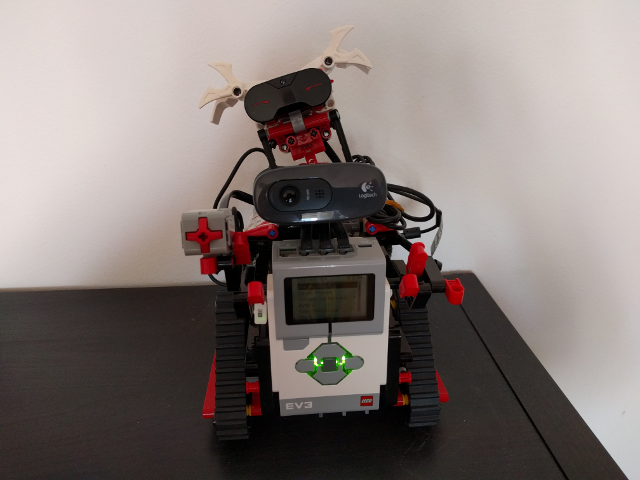

# What?

## Install

### Raspberry PI
sudo apt-get update  
sudo apt-get upgrade  
sudo raspi-config (enable SSH access)  
sudo apt-get install oracle-java8-jdk libopencv2.4-java   

<!-- sudo apt-get install vim fswebcam pavucontrol audacity -->

### EV3Dev
sudo apt-get update  
sudo apt-get upgrade  

## Config

## Run
Locate where you have your JNI OpenCV and set the java.library.path correctly whene exec

java -cp "target/*:target/lib/*" -Djava.library.path=/usr/lib/jni org.danysoft.ev3rpi.RobotUI
